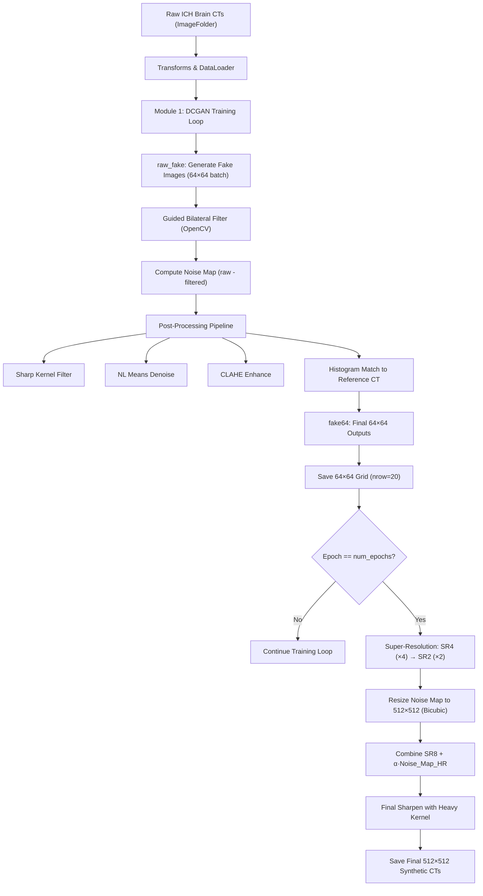

```mermaid

flowchart TD
    A["Raw ICH Brain CTs (ImageFolder)"] --> B["Transforms & DataLoader"]
    B --> C["Module 1: DCGAN Training Loop"]
    C --> D["raw_fake: Generate Fake Images (64×64 batch)"]
    D --> E["Guided Bilateral Filter (OpenCV)"]
    E --> F["Compute Noise Map (raw - filtered)"]
    F --> G["Post-Processing Pipeline"]
    G --> G1["Sharp Kernel Filter"]
    G --> G2["NL Means Denoise"]
    G --> G3["CLAHE Enhance"]
    G --> G4["Histogram Match to Reference CT"]
    G4 --> H["fake64: Final 64×64 Outputs"]
    H --> I["Save 64×64 Grid (nrow=20)"]
    I --> J{"Epoch == num_epochs?"}
    J -->|No| K["Continue Training Loop"]
    J -->|Yes| L["Super-Resolution: SR4 (×4) → SR2 (×2)"]
    L --> M["Resize Noise Map to 512×512 (Bicubic)"]
    M --> N["Combine SR8 + α·Noise_Map_HR"]
    N --> O["Final Sharpen with Heavy Kernel"]
    O --> P["Save Final 512×512 Synthetic CTs"]


```
